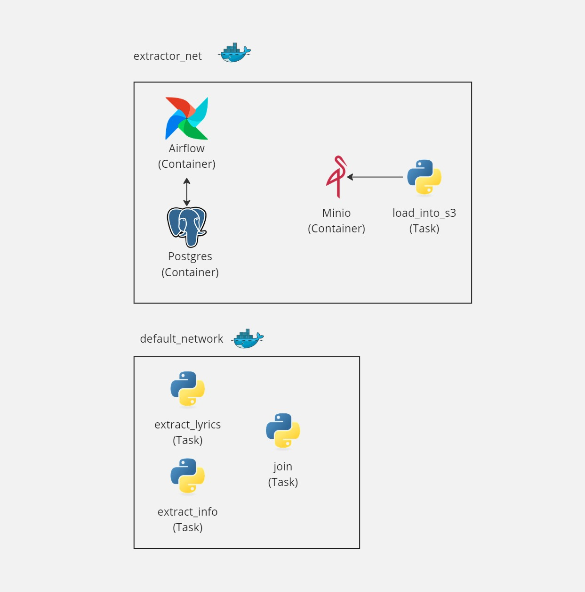

# SpotiBring: Data and audio ETL from Spotify playlists
This project leverages Spotify and Genius apis with task orquestation using Airflow to create a ETL pipeline. To make the storage hardware-independent it loads data into cloud storage (S3), in this case simulated by minio, a local and open-source version of cloud storage.

# Project diagram and functioning
Services are orchestated using Docker Compose. Each service runs in a container in the same network, so they can communicate with each other.



Regarding the Airflow task definition and usage, the phylosophy followed is using docker tasks to fully isolate each task run and avoid libraries dependence errors which could arise when launching tasks from the base Airflow container. \
This approach also lets us define multiple images for different task in case it is needed.\
As task docker containers are created, we mount two volumes onto them, one for code for all tasks and another for a shared temp folder between tasks that need to save or access files. \
To define these tasks the local docker soket is mounted onto the Airflow container. This makes the use of volumes the most convenient option, as the tasks are not running on top of Airflow and sharing files between Airflow and task containers using folder binds is problematic.\
When a task needs to communicate with other containers it is added to the extractor_net Docker network. For this configuration it is only needed for load_into_s3 tasks, as the only communication needed is loading files to Minio.

# Project structure
```
.
├── code
├── extractor_image
├── images
├── services
│   ├── airflow
│   │   ├── dags
│   │   └── logs
│   ├── envs
│   ├── minio
│   └── postgres
└── temp
```
code holds the code files used when launching tasks.\
extractor_image contains Dockerfile and requirements for the tasks docker image. \
images contain the images used in this README file. \
services contains one folder for each service. Developed DAGs are placed in dags folder. envs folder contains the env files for each service. \
temp is the temporary folder used to keep files until they are loaded onto the cloud.

# Tech stack
This project makes use of the following technologies:

- Python as main programming language
- Airflow to orchestate the full process.
- Postgres to serve as storage for Airflow 
- Minio as a S3 clone to mimic storage in a cloud environment. \
It is fully interchangable with S3, you would only need to update acess keys and S3 endpoint accordingly.

It also uses these APIs and python packages to extract the info:
- Spotify API through spotipy client to extract songs from playlists and it's associated info.
- Genius API to extract song lyrics.
- yt_dl to manage the video search in youtube and obtain the associated .mp3 file.

# Requirements
- A working installation of Docker
- A valid Spotify developers app. You can set this logging into https://developer.spotify.com.
- A valid Genius API token.

# Steps to use the project
1. Build the extractor docker image.
docker build -t spotify_extractor ./extractor_image
docker compose up -d 

2. Set env variables needed to run the code in /code/.env. These are:
- SPOTIPY_CLIENT_ID and SPOTIPY_CLIENT_SECRET. These are client id and client secret of the registered spotify app.
- GENIUS_ACESS: this is the acess token to the Genius API.

3. Run the docker compose stack with docker compose up -d (in the root of the project).

4. Specify custom playlists in the spotify_extractor DAG definition, in /services/airflow/dags/extract_spotify.py

5. Trigger DAG run from airflow dashboard logging in http://localhost:2040

6. Wait for the DAG to finish and see the files in the Minio dashboard, in http://localhost:9001

# Considerations when working with this project
If you modify code in /code folder, make sure to run docker compose down -v to remove volumes, so canges are loaded correctly.

# Disclaimer
This project if for demonstrating purposes only. 